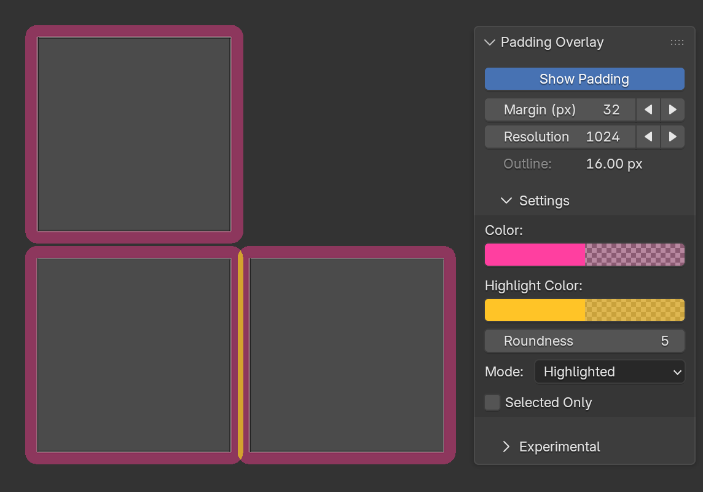
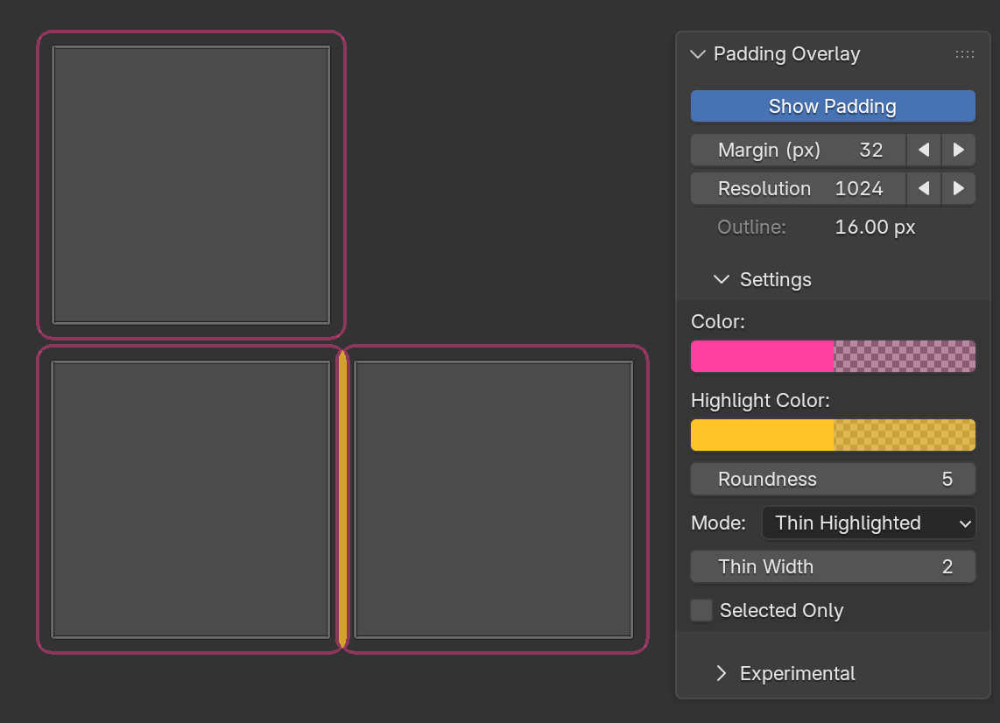
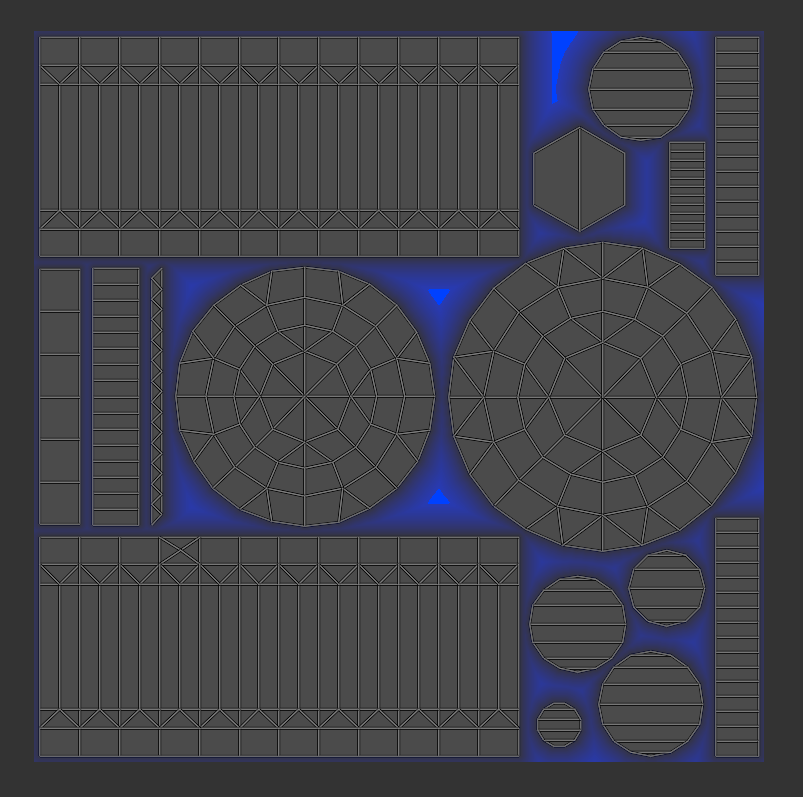

# UV Padding Overlay

See the padding around UV islands.

UV Padding Overlay helps you spot shells that are too close together.



## Requirements

- Blender 4.2–5.3

## Installation

1. Download the [latest](https://github.com/Artic-3D/blender-show-padding/releases/latest) `uv_padding_overlay-*.zip`.
2. In Blender, open **Edit → Preferences → Get Extensions**.
3. Open the menu in the upper-right and choose **Install from Disk**.
4. Select the downloaded ZIP.
5. Enable **UV Padding Overlay** if Blender does not enable it automatically.

## Quick start

1. Select a mesh and enter **Edit Mode**.
2. Open the **UV Editor**.
3. Press `N` to open its sidebar.
4. Select the **Padding** tab.
5. Enable **Show Padding**.
6. Enter your intended **Margin** and texture **Resolution**.

The overlay updates with a slight delay as you edit the UV layout.

## Understanding the margin

**Margin** is the total desired space between two UV shells. Each shell displays
half of that distance around its edge.

For example, an 8 px margin displays a 4 px band around each shell. Two touching
bands indicate exactly 8 px of separation. Overlapping bands reveal insufficient
spacing.

## Display modes

| Mode | Appearance |
| --- | --- |
| **Highlighted** | Uses the highlight color wherever padding bands overlap. |
| **Thin Highlighted** | Shows a thin outer border while keeping problem areas filled. |
| **Stacked** | Draws every band separately, making overlaps appear darker. |
| **Solid** | Combines all bands into one mask with consistent opacity. |



You can right-click **Show Padding** to assign a shortcut or add it to Quick
Favorites. The action is also available through Blender’s operator search.


## Experimental emptiness view

Open **Experimental** and choose **Calculate Emptiness** to visualize unused
space in the main 0–1 UV tile.



The blue field starts outside the visible padding bands and becomes stronger in
larger empty areas. Use the **X** button to clear it.

Recalculate it after changing the UV layout.

## Notes
- The experimental emptiness view analyzes only the main 0–1 tile.
- Margin and resolution are saved per scene.
- Display preferences are shared across Blender files.

## Development

The extension source is in `uv_padding_overlay/`. Blender-hosted tests are in
`tests/`, and the build scripts are in `tools/`.

Run the tests:

```powershell
.\tools\test.ps1
```

Build and validate an installable ZIP:

```powershell
.\tools\build.ps1
```

Both scripts accept a custom Blender executable:

```powershell
.\tools\test.ps1 -Blender "C:\Path\To\blender.exe"
.\tools\build.ps1 -Blender "C:\Path\To\blender.exe"
```

## License

UV Padding Overlay is licensed under the
[GNU General Public License v3.0 or later](uv_padding_overlay/LICENSE).
