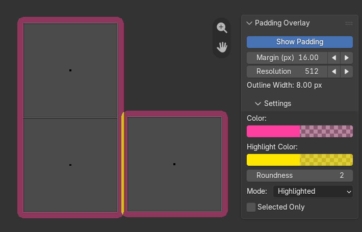

# UV Padding Overlay

Source repository for the Blender 4.2–5.3 UV Padding Overlay extension,
including its experimental manually calculated UV emptiness field.



The extension source is in `uv_padding_overlay/`. Build and validation scripts
are in `tools/`, while Blender-hosted tests are in `tests/`.

See `uv_padding_overlay/README.md` for installation and usage.

Run the Blender-hosted test suite with:

```powershell
.\tools\test.ps1
```

Build and validate the installable extension with:

```powershell
.\tools\build.ps1
```
